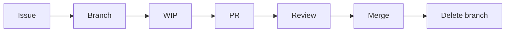
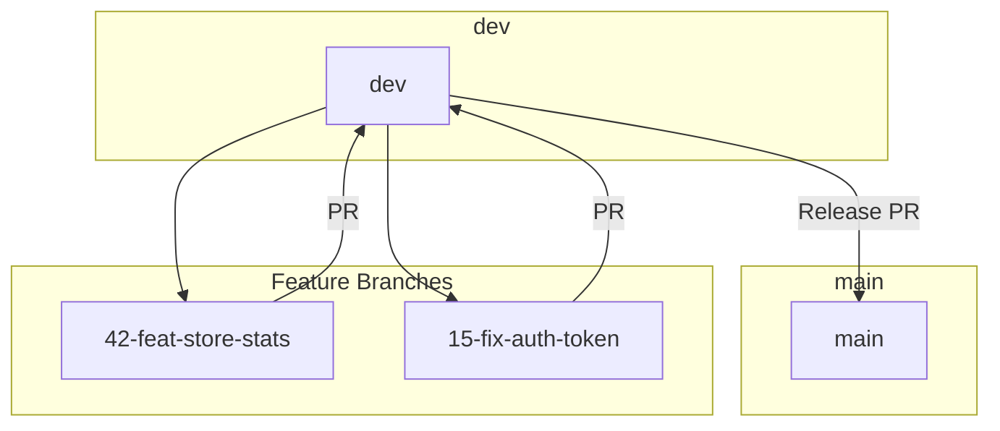

# Branching Strategy — GitHub Flow

Strategy and lifecycle for branches, aligned with [GitHub Flow](https://docs.github.com/en/get-started/quickstart/github-flow) and DORA Lead Time targets.

**References:** [DEVELOPMENT_WORKFLOW.md](DEVELOPMENT_WORKFLOW.md), [PR_REVIEW_PIPELINE.md](PR_REVIEW_PIPELINE.md)

---

## Main Branches

| Branch | Purpose                                                                     |
| ------ | --------------------------------------------------------------------------- |
| `main` | Production-ready code. Merges from `dev` or hotfix branches.                |
| `dev`  | Integration branch. Feature branches target `dev` (or `main` for hotfixes). |

---

## Branch Naming

**Format:** `<issue>-<type>-<slug>`

| Part    | Description                                | Example           |
| ------- | ------------------------------------------ | ----------------- |
| `issue` | GitHub issue number                        | `42`              |
| `type`  | `feat`, `fix`, `refactor`, `chore`, `docs` | `feat`            |
| `slug`  | Short kebab-case description               | `store-add-stats` |

**Examples:**

- `42-feat-store-add-stats-endpoint`
- `15-fix-auth-token-refresh`
- `8-chore-upgrade-deps`

---

## Feature Lifecycle

| Phase  | Action                                      | Lead Time Target (DORA) |
| ------ | ------------------------------------------- | ----------------------- |
| Issue  | Create requirement, acceptance criteria     | —                       |
| Branch | Create from `dev` or `main`                 | —                       |
| WIP    | Implement, commit with Conventional Commits | —                       |
| PR     | Open PR, fill template, link `Closes #N`    | —                       |
| Review | CI, SonarCloud, AI review, human approval   | &lt; 24h                |
| Merge  | Squash/Rebase into target                   | —                       |
| Delete | Remove feature branch after merge           | Immediately             |

**Hotfix:** For urgent production fixes, branch from `main`, target `main`, then merge back to `dev`. Target Lead Time &lt; 1 day.

---

## Branch Protection Rules

Configure in **Settings → Branches → Branch protection rules** for `main` and `dev`:

| Setting                             | Recommendation                                    |
| ----------------------------------- | ------------------------------------------------- |
| Require pull request before merging | Yes — at least 1 approval                         |
| Require status checks               | `CI — Quality Gate` (quality-fast, quality-build) |
| Require branches to be up to date   | Recommended — ensures latest base is tested       |
| Do not allow bypassing              | Yes — enforce for all (including admins)          |
| Restrict who can push               | Block direct push; require PR                     |
| Allow force pushes                  | No                                                |

**Required status checks:** See [PR_REVIEW_PIPELINE.md](PR_REVIEW_PIPELINE.md) — Branch Protection section.

---

## Diagram: Flow

---

## References

- [DEVELOPMENT_WORKFLOW.md](DEVELOPMENT_WORKFLOW.md) — Phase 2: Create Branch
- [PR_REVIEW_PIPELINE.md](PR_REVIEW_PIPELINE.md) — Branch protection checklist
- [GitHub Flow](https://docs.github.com/en/get-started/quickstart/github-flow)
